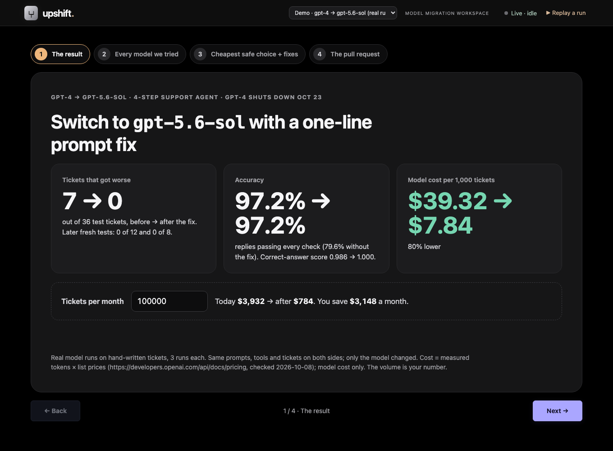
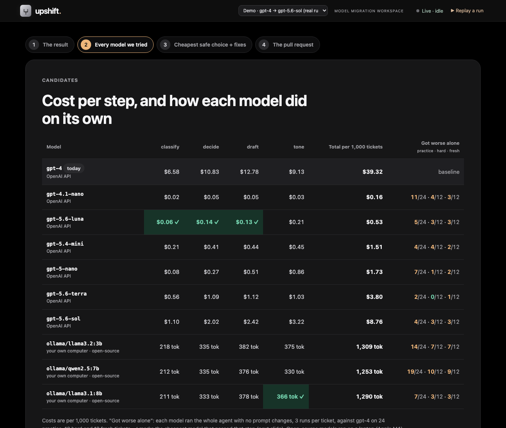
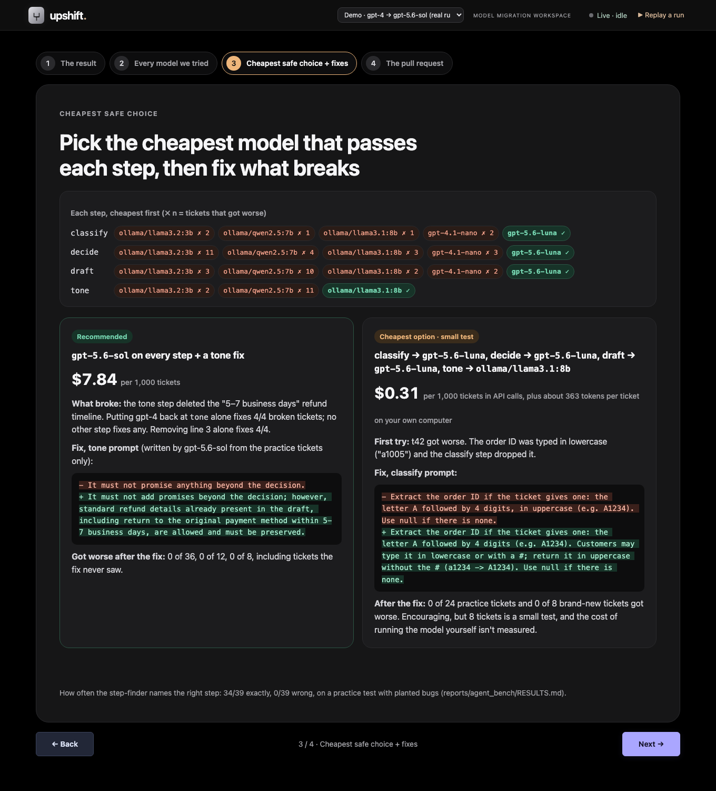
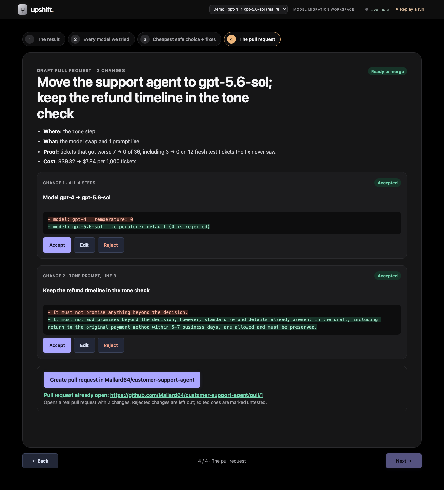

# upshift demo

A 2-minute demo of a real model migration: gpt-4 retires Oct 23, 2026; the support agent moves to gpt-5.6-sol.
upshift finds the one step and the one prompt line the new model broke, writes a 1-line fix, and proves it on
tickets the fixer never saw. Everything replays from cache, offline.

**What's real and what isn't.** The model outputs, costs and token counts are real recorded runs. The 36 support
tickets are hand-written, with hand-written expected outcomes. Nothing was planted in this migration: the
problem is gpt-5.6-sol's own behavior. The step-finder accuracy figure (34/39) comes from a separate
**practice test with planted bugs**, and the dashboard labels it that way.

## Commands

One-time setup (any machine; needs Python 3.11+ and Node 18+):

```bash
git clone https://github.com/Mallard64/upshift && cd upshift
git checkout demo
python3 -m venv .venv && source .venv/bin/activate
pip install -r requirements.txt
```

The demo itself (no API key, no network; works with Wi-Fi off):

```bash
python demo.py --demo
```

That narrates the run in the terminal (about 1 minute) and serves the dashboard. Open
**http://localhost:4173/** for a four-slide deck. Use Next/Back, the numbered slide buttons, or the ← → keys.
Each slide has its own link: `#results`, `#models`, `#choice`, `#pr`.

| Flag | Use it when |
|---|---|
| `--speed 2` | You're short on time; the replay runs twice as fast |
| `--no-server` | The dashboard is already open, or you only want the terminal |
| `--port 4174` | Port 4173 is taken |

Rebuild the dashboard data from cache, if anything looks stale (free, offline):

```bash
python results_demo.py
```

Re-run the real experiments (costs money; a hard cap in `llm.py` stops paid calls at `LLM_SPEND_CAP_USD`, default $15). Every call is cached, so a repeat costs nothing:

```bash
set -a; source .env; set +a
python model_only.py
python assign.py
python results_demo.py
```

**Wi-Fi backup.** Before the pitch, run `python demo.py --demo --speed 10` once with Wi-Fi off to confirm. If the
laptop dies, `docs/demo/` has the four slide screenshots and the terminal transcript (`terminal.txt`).

## 2-minute script

**0:00 · Slide 1 (The result) on screen.**
"gpt-4 shuts down October 23rd. Every team on it has to switch, and the hard part isn't the switch. It's knowing
what broke. We took a 4-step support agent and changed only the model."

**0:15 · Start `python demo.py --demo` in the terminal.**
"Same prompts, same tools, same tickets, 3 runs each. On gpt-5.6-sol, 4 of 24 tickets got worse than gpt-4, and
gpt-4 gave the same answer every run, so it isn't noise. The reply stops telling customers their refund takes
5 to 7 business days."

**0:35 · Stage 2 scrolls by.**
"Which step? We put gpt-4 back one step at a time. Only the tone step fixes it: 4 out of 4. Then the reverse check:
the new model on that step alone breaks it again on 2 of 4. That's proof, not a guess."

**0:55 · Stages 3 and 4.**
"Which line? Remove each line of the tone prompt. Only line 3, 'must not promise anything beyond the decision', fixes
it. The new model reads the refund timeline as an extra promise and deletes it. The fix rewrites that one line, and
it was written from these 4 tickets only."

**1:10 · Back to slide 1.**
"Then the test that matters: 12 tickets the fix never saw. 3 broke before, 0 after. Cost per 1,000 tickets goes
from $39 to $7.84, 80% lower, with the same pass rate. Type in your own volume: at 100,000 tickets a month that's
about $3,100 a month."

**1:30 · Slide 2 (Every model we tried).**
"We also tried seven cheaper models, including open-source ones running on a laptop. Alone, every one of them breaks
something. But step by step, some are good enough."

**1:40 · Slide 3 (Cheapest safe choice + fixes).**
"gpt-5.6-luna can do three steps and a free local Llama can do tone. It first broke a ticket with a lowercase order
ID; one line fixed that, and it passed 8 new tickets at 31 cents per 1,000. That's a small test, so today we
recommend sol plus the tone fix."

**1:50 · Slide 4 (The pull request).**
"The output is a pull request: the model swap and one prompt line, each accepted, edited or rejected by your
engineer. We investigate; you decide."

## What each slide proves

### Slide 1 · The result (`#results`), for the buyer


| Shows | Comes from | Doesn't claim |
|---|---|---|
| Tickets that got worse 7 → 0 of 36; later fresh tests 0 of 12 and 0 of 8 | `model_only.py`, `model_pool.py`, `mix_retest.py`; 3 runs per ticket | Results on real customer traffic |
| Accuracy 97.2% → 97.2% replies passing every check (79.6% without the fix) | All 108 runs (36 tickets × 3) | Quality on real customer traffic |
| $39.32 → $7.84 per 1,000 tickets (−80%) | Measured tokens per step × list prices in `config/prices.yml` (OpenAI pricing page, checked Oct 8) | Infra, engineering or caching costs. Model cost only. |
| Monthly savings | The viewer's own volume × the measured cost per ticket | The default 100,000/month is an assumption, labelled on the page |

### Slide 2 · Every model we tried (`#models`)


| Shows | Comes from |
|---|---|
| Cost per step for every model (dollars, or tokens for open-source models on your own computer) | Real token counts from each model's runs × `config/prices.yml` |
| "Got worse alone" on 24 practice · 12 hard · 12 fresh tickets | Each model ran the whole agent with no prompt changes, 3 runs per ticket, vs gpt-4 |
| ✓ on the cheapest model that passed each step | The per-step test on slide 3 |

### Slide 3 · Cheapest safe choice + fixes (`#choice`), for the engineer


| Shows | Comes from |
|---|---|
| Per-step ladder: each step tried cheapest first until nothing got worse | `model_pool.py` (gpt-5.6-sol + fix runs every other step) |
| Recommended: sol + tone fix. gpt-4 back at tone fixes 4/4; removing tone line 3 fixes 4/4 | `model_only.py`, 3 runs per experiment |
| Cheapest option: luna + local Llama 3.1 8B, $0.31 per 1,000 in API calls. First failed t42 (lowercase ID), passed 8 new tickets after a one-line classify fix | `model_pool.py`, `mix_retest.py`. Small test; running Llama yourself isn't priced |
| Step-finder accuracy 34/39 exact, 0 wrong | **Practice test with planted bugs** (`reports/agent_bench/RESULTS.md`), numbers from tickets it wasn't tuned on |

The reverse check on the tone step is 2/4, not 4/4: on t21 and t24 the new model's tone step only drops the timeline
when the new model also wrote the draft. Say so if asked.

### Slide 4 · The pull request (`#pr`), the product


Two changes, each with Accept / Edit / Reject: the model swap (gpt-4 at temperature 0 → gpt-5.6-sol at its default,
because it rejects 0) and tone line 3. An edited line is marked "re-run needed".

**Create pull request** opens a real PR in the app repo, [Mallard64/customer-support-agent](https://github.com/Mallard64/customer-support-agent)
(private; set in `config/target_repo.yml`). It's enabled once every change is accepted, edited or rejected:
- Only accepted and edited changes go in. Edited ones are marked "not re-tested" in the PR, and rejected ones are listed as left out.
- Before changing a prompt line, it checks that the line still says what upshift tested.
- The same set of changes always reuses the PR that's already open, so clicking twice doesn't create a duplicate.

Needs internet and `gh auth login` with access to that repo. It's the one part of the demo that isn't offline.

**Before a pitch:** PR #1 is already open from testing, so the button will show "already open". To create it live in
front of people, close PR #1 first (`gh pr close 1 --repo Mallard64/customer-support-agent`). The next click opens a fresh one.

## Likely questions

- **"Is the problem real?"** Yes. Only the model changed (plus the forced sampling default). gpt-4 failed the
  timeline check 0 of 3 times on every one of those tickets.
- **"Are the tickets real customers?"** No. They're 36 hand-written tickets with expected outcomes. The model behavior
  on them is real.
- **"How do you know the fix generalizes?"** It was written from 4 practice tickets and checked once on 12 fresh test tickets
  it never saw: 3 → 0 got worse. That's a small sample. The next step is a design partner's real traffic.
- **"Why not just use the cheapest model everywhere?"** We tried, step by step. The cheap mix broke a fresh test ticket
  (t33: tone step returned non-JSON), so it isn't recommended.

## Bigger model list

We also tried 7 cheaper models: 4 low-cost OpenAI models and 3 open-source models running on a laptop through
Ollama. Each one, used alone for the whole agent, made some tickets worse than gpt-4. One step at a time worked
better: gpt-5.6-luna handled classify, decide and draft, and the open-source Llama 3.1 8B handled tone.

That mix first failed one fresh ticket (t42), because luna ignored order IDs typed in lowercase ("a1005"). After a
one-line fix to the classify prompt, the mix passed 8 brand-new test tickets (0 got worse), at **$0.31 per 1,000
tickets** in API calls plus the cost of running Llama on your own hardware (not measured yet).

Eight tickets is a small test, chosen to save cost. Treat the mix as a promising cheaper option. The recommendation
stays gpt-5.6-sol + the 1-line fix until the mix passes a bigger test and the self-hosted cost is measured.
