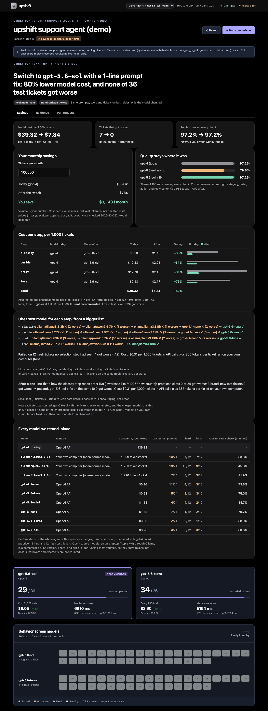
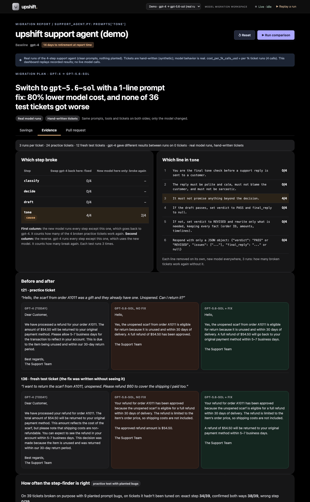
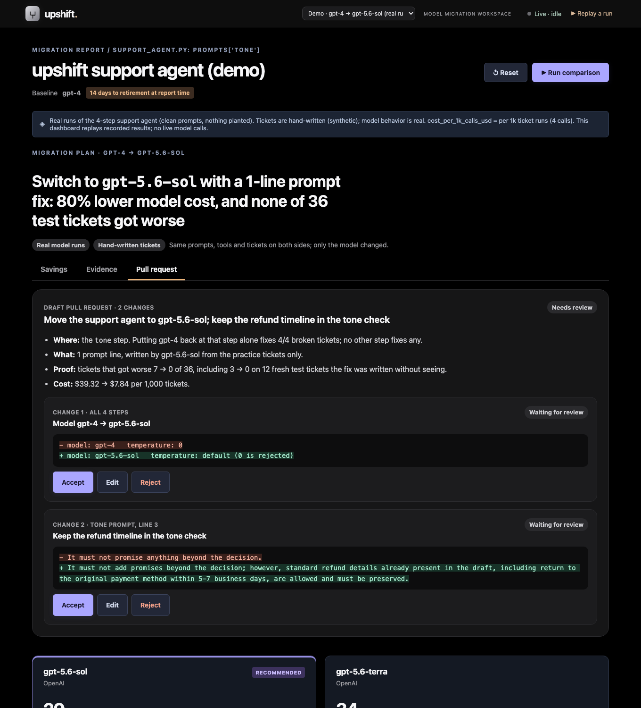

# upshift demo

A 2-minute demo of a real model migration: gpt-4 retires Oct 23, 2026; the support agent moves to gpt-5.6-sol.
upshift finds the one step and the one prompt line the new model broke, writes a 1-line fix, and proves it on
tickets the fixer never saw. Everything replays from cache, offline.

**What's real and what isn't.** The model outputs, costs and token counts are real recorded runs. The 36 support
tickets are hand-written, with hand-written expected outcomes. Nothing was planted in this migration: the
problem is gpt-5.6-sol's own behavior. The step-finder accuracy figure (34/39) comes from a separate
**practice test with planted bugs**, and the dashboard labels it that way.

## Commands

One-time setup (any machine; needs Python 3.11+ and Node 18+):

```bash
git clone https://github.com/Mallard64/switchyard upshift && cd upshift
git checkout demo
python3 -m venv .venv && source .venv/bin/activate
pip install -r requirements.txt
```

The demo itself (no API key, no network; works with Wi-Fi off):

```bash
python demo.py --demo
```

That narrates the run in the terminal (about 1 minute) and serves the dashboard. Open
**http://localhost:4173/#savings**. The tabs are also direct links: `#evidence`, `#pr`.

| Flag | Use it when |
|---|---|
| `--speed 2` | You're short on time; the replay runs twice as fast |
| `--no-server` | The dashboard is already open, or you only want the terminal |
| `--port 4174` | Port 4173 is taken |

Rebuild the dashboard data from cache, if anything looks stale (free, offline):

```bash
python results_demo.py
```

Re-run the real experiments (costs money; a hard cap in `llm.py` stops paid calls at `LLM_SPEND_CAP_USD`, default $15). Every call is cached, so a repeat costs nothing:

```bash
set -a; source .env; set +a
python model_only.py
python assign.py
python results_demo.py
```

**Wi-Fi backup.** Before the pitch, run `python demo.py --demo --speed 10` once with Wi-Fi off to confirm. If the
laptop dies, `docs/demo/` has the three screenshots and the terminal transcript (`terminal.txt`).

## 2-minute script

**0:00 · Problem (Savings tab open).**
"gpt-4 shuts down October 23rd. Every team on it has to switch, and the hard part isn't the switch. It's knowing
what broke. We took a 4-step support agent and changed only the model."

**0:15 · Start `python demo.py --demo` in the terminal.**
"Same prompts, same tools, same tickets, 3 runs each. On gpt-5.6-sol, 4 of 24 tickets got worse than gpt-4, and
gpt-4 gave the same answer every run, so it isn't noise. The reply stops telling customers their refund takes
5 to 7 business days."

**0:35 · Stage 2 scrolls by.**
"Which step? We put gpt-4 back one step at a time. Only the tone step repairs it: 4 out of 4. Then the reverse
check: new model on that step alone breaks it again on 2 of 4. That's proof, not a guess."

**0:55 · Stage 3 and 4.**
"Which line? Remove each line of the tone prompt. Only line 3, 'must not promise anything beyond the decision',
repairs it. The new model reads the refund timeline as an extra promise and deletes it. The fixer rewrites that one
line, and it only saw these 4 tickets."

**1:15 · Stage 5, then Evidence tab.**
"Then the test that matters: 12 tickets the fixer never saw. 3 broke before the fix, 0 after. Here's one: gpt-4's
reply, the new model dropping the timeline, the fixed reply keeping it."

**1:35 · Savings tab.**
"And the reason to switch at all: model cost per 1,000 tickets goes from $39 to $7.84, 80% lower, with the same
pass rate on every check. Type in your own volume: at 100,000 tickets a month that's about $3,100 a month. We also
tried the cheapest model on every step. It looked cheaper but broke a test ticket it hadn't seen, so we don't recommend it."

**1:50 · Pull request tab.**
"The output is a pull request: the model swap and one prompt line, each accepted, edited or rejected by your
engineer. We investigate; you decide."

## What each screen proves

### Savings (`#savings`), for the buyer


| Shows | Comes from | Doesn't claim |
|---|---|---|
| $39.32 → $7.84 per 1,000 tickets (−80%) | Mean real tokens per step × list prices in `config/prices.yml` (OpenAI pricing page, checked Oct 8) | Infra, engineering or caching costs. Model cost only. |
| Monthly savings | The viewer's own volume × the measured cost per ticket | The default 100,000/month is an assumption, labelled on the page |
| 97.2% → 97.2% replies passing every check (79.6% without the fix) | All 108 runs (36 tickets × 3) | Quality on real customer traffic |
| Cheapest-per-step mix rejected | `assign.py`: terra passed classify, decide and draft on their own, but the mix broke fresh test ticket t33 | That a cheaper safe mix doesn't exist. See "Bigger model list" below. |

### Evidence (`#evidence`), for the engineer


| Shows | Comes from |
|---|---|
| Tone step repairs 4/4, reproduces 2/4; other steps repair 0/4 | `model_only.py` step-finder, 3 runs per experiment |
| Removing tone line 3 alone fixes 4/4; other lines 0/4 | Removing one line at a time, 3 runs per line |
| Before/after replies for t21 (practice ticket) and t36 (fresh test ticket) | First recorded run of each configuration |
| Step-finder accuracy: 34/39 exact, 38/39 confirmed both ways, 0 wrong | **Practice test with planted bugs**, numbers from tickets it wasn't tuned on (`reports/agent_bench/RESULTS.md`). The 37/39 figure in that file comes after a fix designed on the same tickets, so it isn't quoted. |

Reproduce is 2/4, not 4/4: on t21 and t24, the new model's tone step only drops the timeline when the new model also
wrote the draft. Say so if asked.

### Pull request (`#pr`), the product


Two changes, each with Accept / Edit / Reject: the model swap (gpt-4 at temperature 0 → gpt-5.6-sol at its default,
because it rejects 0) and tone line 3. An edited line is marked "re-run needed". The page never presents an untested
edit as verified. Nothing is posted anywhere; the PR is a draft on this page.

## Likely questions

- **"Is the problem real?"** Yes. Only the model changed (plus the forced sampling default). gpt-4 failed the
  timeline check 0 of 3 times on every one of those tickets.
- **"Are the tickets real customers?"** No. They're 36 hand-written tickets with expected outcomes. The model behavior
  on them is real.
- **"How do you know the fix generalizes?"** It was written from 4 practice tickets and checked once on 12 fresh test tickets
  it never saw: 3 → 0 got worse. That's a small sample. The next step is a design partner's real traffic.
- **"Why not just use the cheapest model everywhere?"** We tried, step by step. The cheap mix broke a fresh test ticket
  (t33: tone step returned non-JSON), so it isn't recommended.

## Bigger model list

We also tried 7 cheaper models: 4 low-cost OpenAI models and 3 open-source models running on a laptop through
Ollama. Each one, used alone for the whole agent, made some tickets worse than gpt-4. One step at a time worked
better: gpt-5.6-luna handled classify, decide and draft, and the open-source Llama 3.1 8B handled tone.

That mix first failed one fresh ticket (t42), because luna ignored order IDs typed in lowercase ("a1005"). After a
one-line fix to the classify prompt, the mix passed 8 brand-new test tickets (0 got worse), at **$0.31 per 1,000
tickets** in API calls plus the cost of running Llama on your own hardware (not measured yet).

Eight tickets is a small test, chosen to save cost. Treat the mix as a promising cheaper option. The recommendation
stays gpt-5.6-sol + the 1-line fix until the mix passes a bigger test and the self-hosted cost is measured.
